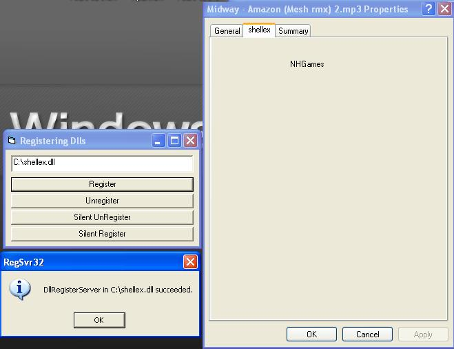



## Registering\\Unregistering Dlls

### Description

Registering\Unregistering\Slient Dlls From VB!
 
### More Info
 

             |
---                |---
**Submitted On**   |2005-03-25 10:10:38
**By**             |[NHGames](https://github.com/Planet-Source-Code/PSCIndex/blob/master/ByAuthor/nhgames.md)
**Level**          |Beginner
**User Rating**    |3.7 (11 globes from 3 users)
**Compatibility**  |VB 6\.0
**Category**       |[Coding Standards](https://github.com/Planet-Source-Code/PSCIndex/blob/master/ByCategory/coding-standards__1-43.md)
**World**          |[Visual Basic](https://github.com/Planet-Source-Code/PSCIndex/blob/master/ByWorld/visual-basic.md)
**Archive File**   |[Registerin1868213252005\.zip](https://github.com/Planet-Source-Code/nhgames-registering-unregistering-dlls__1-59646/archive/master.zip)

